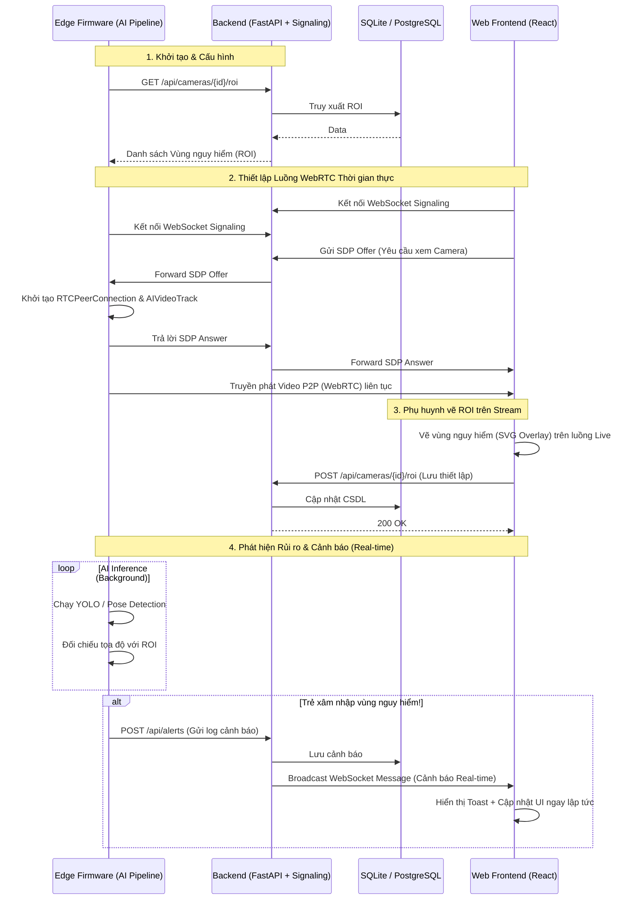

# AI Child Guardian: Hệ thống Giám sát & Bảo vệ Trẻ em Chủ động

AI Child Guardian là giải pháp an ninh gia đình thế hệ mới, chuyển đổi mô hình giám sát từ bị động sang chủ động bằng **Trí tuệ nhân tạo (Edge AI)** và công nghệ truyền phát **WebRTC độ trễ thấp**.

Hệ thống cho phép phụ huynh cấu hình các vùng nguy hiểm (ROI - Region of Interest) trực tiếp trên luồng video thời gian thực. Khi phát hiện trẻ em có nguy cơ xâm nhập vùng cấm, hệ thống tự động đẩy cảnh báo (Alert) ngay lập tức tới thiết bị của phụ huynh.

---

## 🔄 Luồng Kiến trúc Hệ thống (Sequence Diagram)

Sơ đồ dưới đây mô tả sự tương tác giữa 3 thành phần cốt lõi: **Edge Firmware (Camera/AI)**, **Backend (Máy chủ trung tâm)** và **Frontend (Giao diện phụ huynh)**.



---

## 🏗️ Cấu trúc Module

Dự án được triển khai theo kiến trúc Microservices linh hoạt:

1. **`module_edge_firmware/`**: Phần mềm chạy tại camera/thiết bị biên (Jetson, Raspberry Pi, PC). Xử lý đọc luồng video, chạy mô hình AI (`MultiTaskRunner`) và giao tiếp WebRTC bằng `aiortc`.
2. **`module_backend_infra/`**: Máy chủ API viết bằng **FastAPI**. Quản lý CSDL (Camera, ROI, Alerts) và tích hợp **Signaling Server** (WebSocket) để kết nối P2P.
3. **`frontend/`**: Giao diện Web SPA viết bằng **React + TypeScript + TailwindCSS**. Hỗ trợ xem nhiều camera cùng lúc, vẽ ROI động qua `SVG`, nhận cảnh báo tức thời.
4. **`module_ai_core/`**: Lưu trữ logic tải, huấn luyện và quản lý các mô hình YOLO/Pose (`registry.json`).

---

## 🚀 Hướng dẫn Chạy hệ thống

### Cách 1: Chạy bằng Docker Compose (Khuyên dùng cho Production)
Toàn bộ hệ thống đã được đóng gói sẵn thành các container riêng biệt. Bạn chỉ cần 1 lệnh duy nhất:

```bash
docker compose up --build -d
```
- **Frontend**: Truy cập tại `http://localhost:5173`
- **Backend API**: Truy cập tại `http://localhost:8007` (Tài liệu API: `http://localhost:8007/docs`)

*Để dừng hệ thống: `docker compose down`*

---

### Cách 2: Chạy độc lập (Local Development)

Nếu bạn muốn lập trình và sửa code trực tiếp, hãy khởi chạy từng module trong các terminal riêng:

#### 1. Chạy Backend (FastAPI)
```bash
# Sử dụng 'uv' để chạy môi trường ảo
# Lưu ý: Bỏ cờ --reload hoặc thêm --reload-exclude "*.db" để tránh backend bị reset khi SQLite ghi data ROI/Alert
uv run uvicorn module_backend_infra.main:app --host 0.0.0.0 --port 8007
```

#### 2. Chạy Frontend (React)
```bash
cd frontend
npm install
npm run dev
```
Truy cập: `http://localhost:5173`

#### 3. Chạy Thiết bị Biên / Camera (Edge Firmware)
```bash
# Kích hoạt camera và pipeline AI
uv run module_edge_firmware/pipeline.py
```

---

## ⚙️ Các Tính năng Nổi bật

- **Xem Video Độ trễ siêu thấp**: Khác với HLS hay RTSP truyền thống, hệ thống ứng dụng WebRTC P2P mang lại độ trễ dưới 100ms.
- **ROI Khớp với Thực tế**: Bằng cách tái sử dụng (reuse) luồng WebRTC, khi phụ huynh chuyển sang màn hình vẽ Vùng nguy hiểm, video trực tiếp làm nền giúp phụ huynh vẽ tọa độ chính xác tuyệt đối với những gì AI nhìn thấy.
- **Cơ chế tải Mô hình Phân mảnh (Partial Loading)**: Module AI Core sử dụng registry thông minh, cho phép tùy ý bật/tắt (Enable/Disable) các mô hình Object Detection hoặc Pose tuỳ thuộc vào cấu hình phần cứng Edge mà không gây lỗi ứng dụng.
- **Auto-reconnect & Cảnh báo Tức thời**: Giao diện liên tục đồng bộ qua WebSocket, nếu trẻ vi phạm vùng cấm, âm thanh và thông báo Toast sẽ hiển thị lập tức trên Web.
