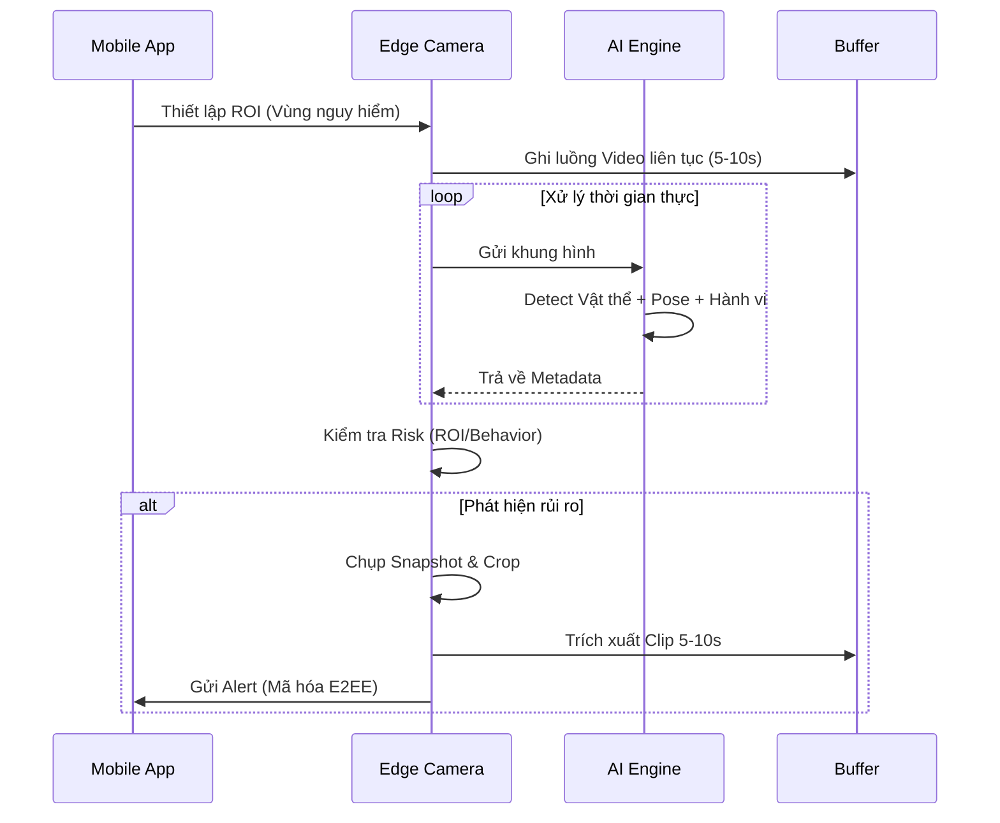

# AI Child Guardian: Hệ thống Giám sát & Bảo vệ Trẻ em Chủ động

AI Child Guardian là một giải pháp an ninh gia đình thế hệ mới, chuyển đổi mô hình giám sát từ bị động sang chủ động bằng trí tuệ nhân tạo (Edge AI) và cơ chế Human-in-the-loop.

## 🔄 Pipeline hoạt động


## 🏗️ Cấu trúc Module
Dự án được chia thành các module chuyên biệt:
- [**module-ai-core**](./module_ai_core/README.md): Quản lý mô hình YOLO26 & ST-GCN.
- [**module-edge-firmware**](./module_edge_firmware/README.md): Xử lý tại biên (Inference & Pipeline).
- [**module-security**](./module_security/README.md): Mã hóa E2EE & Tuân thủ QCVN 135.
- [**module-backend-infra**](./module_backend_infra/README.md): Active Learning & Auth.
- [**module-mobile-app**](./module_mobile_app/README.md): Giao diện Flutter (Placeholder).

## ⚙️ Cấu hình hệ thống (.env)
Hệ thống sử dụng file `.env` để quản lý các biến môi trường quan trọng. Hãy copy từ `.env.example`:

```bash
cp .env.example .env
```

**Các biến quan trọng:**
- `RTSP_URL`: Luồng camera IP.
- `E2EE_SECRET_KEY`: Khóa mã hóa dữ liệu cảnh báo.
- `INFERENCE_DEVICE`: `cuda:0` để dùng GPU hoặc `cpu`.
- `YOLO_MODEL_PATH`: Đường dẫn file weights.

## 🚀 Hướng dẫn sử dụng

### 1. Cài đặt môi trường
Dự án sử dụng `uv` để quản lý dependencies:
```bash
uv sync
source .venv/bin/activate
```

### 2. Chuẩn bị dữ liệu & Mô hình
Tạo cấu trúc thư mục và tải trọng số (nếu có):
```bash
python main.py --mode prepare-data
```

### 3. Chạy hệ thống giám sát (Edge Pipeline)
```bash
python main.py --mode edge
```

### 4. Kiểm tra tuân thủ bảo mật
```bash
python main.py --mode compliance
```

## 🛠️ Chạy riêng lẻ từng Module
- **Huấn luyện AI**: Xem chi tiết tại [AI Core README](./module_ai_core/README.md).
- **Chuyển đổi mô hình**: `python scripts/convert_model.py --model weights/yolo26n.pt --format onnx`.
- **Chạy Tests**: `uv run pytest tests/`.

## 🧪 Chiến lược Kiểm thử & Giả lập (Emulation Strategy)

Để đảm bảo tiến độ 7 ngày, hệ thống hỗ trợ các cơ chế kiểm thử khi thiếu điều kiện:

### 1. Kiểm thử Edge (Module 2) khi chưa có AI & Camera:
- **Video Emulation**: Thay `RTSP_URL` trong `.env` bằng đường dẫn file `.mp4`.
- **AI Mocking**: Sử dụng `MockAIService` trong `module_edge_firmware/inference/mock_ai_service.py` để giả lập các tình huống nguy hiểm (té ngã, bạo lực) mà không cần model thật.

### 2. Kiểm thử Mobile (Module 3) khi chưa có Edge/Backend:
- **Mock Data**: Sử dụng dữ liệu JSON tĩnh để render UI thông báo và lịch sử.
- **Local Server**: Chạy một script Python đơn giản để gửi các gói tin mã hóa giả lập qua Socket tới App.

### 3. Kiểm thử AI (Module 1) khi chưa có phần cứng:
- **CPU Inference**: Cấu hình `INFERENCE_DEVICE=cpu` trong `.env` để chạy thử trên Laptop.
- **Validation Set**: Sử dụng tập test của ChildSUn và Violence để đánh giá độ chính xác (mAP) độc lập với hệ thống camera.

## 🛠️ Quy trình tích hợp (7 ngày)
- **Ngày 1-3**: Phát triển độc lập bằng Mocking.
- **Ngày 4**: "Giao thoa" (Integration) - Thay Mock bằng model thật/stream thật.
- **Ngày 5-7**: Tinh chỉnh và Fix bug toàn hệ thống.
