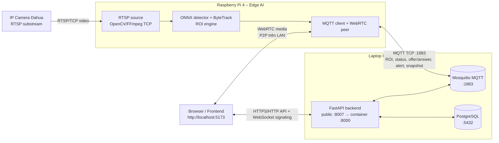
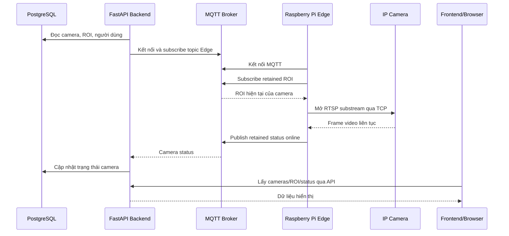
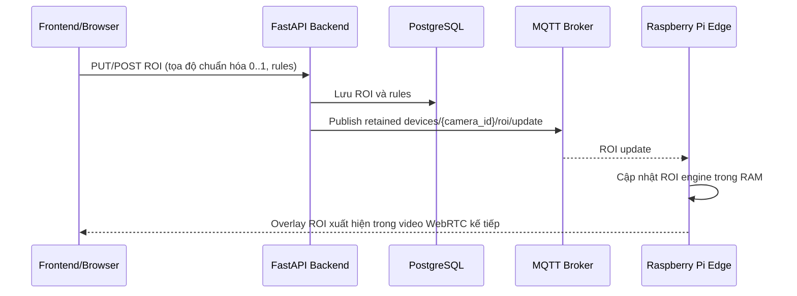
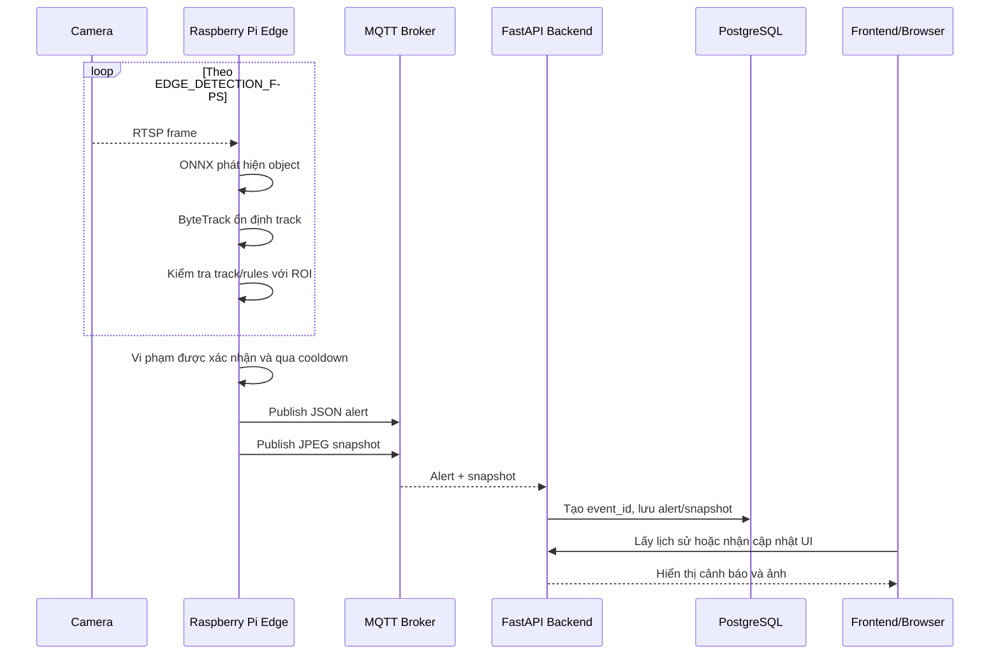
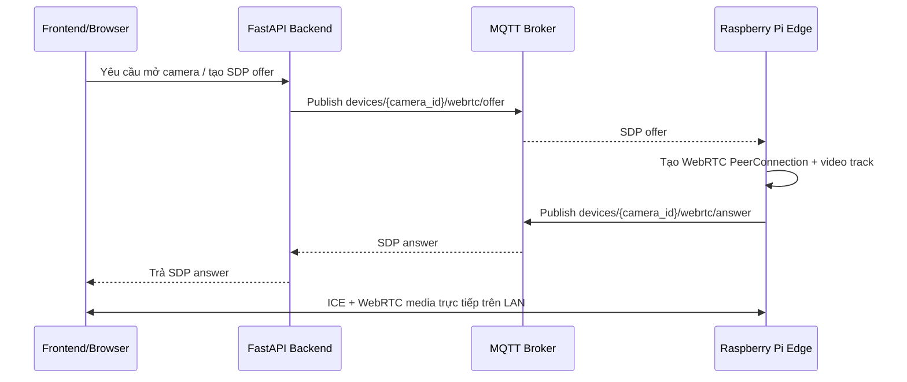
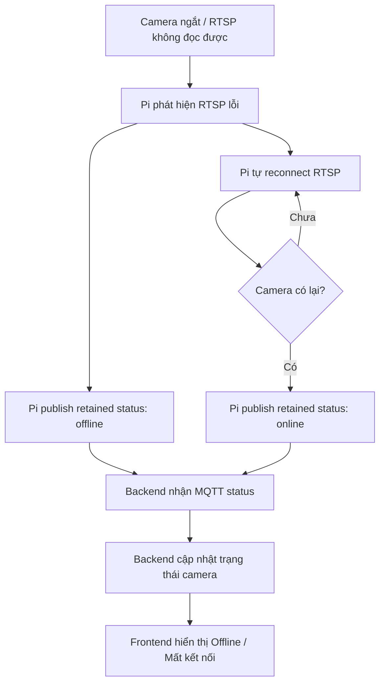

# Luồng local: Camera, Raspberry Pi Edge, Backend, MQTT và Frontend

Tài liệu này mô tả đúng cấu hình demo/local đã chạy: **laptop** chạy PostgreSQL, MQTT Broker, FastAPI và Frontend bằng Docker Compose; **Raspberry Pi 4** chạy Edge AI; **camera Dahua** cung cấp RTSP. Ba thiết bị cần ở cùng mạng LAN để xem video WebRTC trực tiếp ổn định.

## 1. Vai trò của từng thành phần

| Thành phần | Chạy ở đâu | Nhiệm vụ chính | Không làm gì |
|---|---|---|---|
| IP Camera | Camera Dahua | Phát luồng RTSP video | Không chạy AI, không biết ROI |
| Raspberry Pi / Edge | Raspberry Pi 4 | Đọc RTSP, chạy ONNX + ByteTrack + ROI, gửi trạng thái/cảnh báo/snapshot, trả lời WebRTC | Không lưu DB, không phục vụ giao diện |
| MQTT Broker | Laptop, container `guardian_mqtt` | Kênh pub/sub trung gian tin nhắn giữa Edge và Backend | Không xử lý AI, không lưu alert vào PostgreSQL |
| Backend FastAPI | Laptop, container `guardian_fastapi` | API cho Frontend, lưu PostgreSQL, đồng bộ ROI, nhận alert/snapshot/status MQTT, cấp luồng signaling | Không đọc RTSP, không chạy ONNX |
| PostgreSQL | Laptop, container `guardian_postgres` | Lưu camera, ROI, alert và dữ liệu nghiệp vụ | Không nhận MQTT trực tiếp |
| Frontend | Browser, tải từ containezr `guardian_frontend` | Cho người dùng đăng nhập, vẽ ROI, xem cảnh báo và yêu cầu xem camera | Không kết nối RTSP đến camera, không chạy AI |

## 2. Sơ đồ kiến trúc và các kiểu giao tiếp

Điểm cần nhớ: video AI đi theo đường **Camera → Pi**, còn video xem trên giao diện đi theo đường **Pi → Browser bằng WebRTC**. MQTT/Backend chỉ điều phối (ROI, signaling, alert, snapshot, status); chúng **không chuyển tiếp từng frame video** trong luồng local này.

## 3. Luồng khởi động hệ thống

Nếu Pi được khởi động sau khi ROI đã được vẽ, retained message giúp Pi nhận ROI ngay, không phải chờ người dùng lưu lại ROI lần nữa.

## 4. Luồng thiết lập ROI

ROI được lưu hai nơi với hai mục đích khác nhau:

- **PostgreSQL** là nguồn dữ liệu bền vững, phục vụ API/giao diện.
- **RAM trên Pi** là bản đang được AI dùng ngay cho từng frame.
- MQTT retained là cầu nối để Pi nhận lại cấu hình sau restart hoặc reconnect.

## 5. Luồng AI, cảnh báo và snapshot

AI chỉ tạo alert khi object/track thỏa rules của ROI. `EDGE_ALERT_COOLDOWN_SECONDS` chống việc cùng một tình huống sinh quá nhiều alert liên tiếp.

## 6. Luồng xem video trực tiếp (WebRTC)

MQTT chỉ mang SDP offer/answer rất nhỏ. Video không đi qua MQTT và không đi qua FastAPI. Vì vậy MQTT có thể kết nối bình thường nhưng video vẫn không xem được nếu WebRTC/ICE/Pi mạng lỗi.

## 7. MQTT topic hiện dùng

Mọi topic phụ thuộc vào `EDGE_CAMERA_ID`, hiện là `camera_living_room_01`.

| Topic | Hướng | Dữ liệu | Retained |
|---|---|---|---|
| `devices/{camera_id}/roi/update` | Backend → Pi | Danh sách ROI và rules | Có |
| `devices/{camera_id}/webrtc/offer` | Backend → Pi | SDP offer từ browser | Không |
| `devices/{camera_id}/webrtc/answer` | Pi → Backend | SDP answer từ Pi | Không |
| `devices/{camera_id}/alerts` | Pi → Backend | Metadata cảnh báo | Không |
| `devices/{camera_id}/snapshots` | Pi → Backend | JPEG snapshot dạng binary | Không |
| `devices/{camera_id}/status` | Pi → Backend | `online`, `state`, `reason`, timestamp | Có |

## 8. Khi camera mất kết nối

Trạng thái **online/offline** phản ánh khả năng Pi đọc RTSP camera, không chỉ phản ánh việc browser có đang mở video hay không.

## 9. Cổng và địa chỉ local cần biết

| Dịch vụ | Địa chỉ từ laptop/browser | Địa chỉ từ Pi | Mục đích |
|---|---|---|---|
| Frontend | `http://localhost:5173` | Không cần Pi truy cập | Giao diện |
| Backend API | `http://localhost:8007` | Chỉ cần khi bật REST fallback | API và signaling |
| MQTT Broker | `localhost:1883` | `<IP_LAN_LAPTOP>:1883` | Điều phối Edge/Backend |
| PostgreSQL | `localhost:5432` | Không được Pi truy cập trực tiếp | Dữ liệu backend |
| RTSP Camera | Không cần laptop truy cập | `rtsp://<camera>/...` | Video đầu vào AI |

`MQTT_BROKER_HOST` trong `/etc/children-observer/edge.env` phải là IP LAN của **laptop đang chạy Docker MQTT**, không phải `localhost`. Trên Pi, `localhost` luôn trỏ về chính Pi.

## 10. Checklist xác minh quan hệ giữa các thành phần

1. Camera → Pi: Pi log có `RTSP stream connected`.
2. Pi → MQTT: Pi log có `MQTT connected`.
3. MQTT → Pi: thay đổi ROI trên UI, Pi log có `Applied ... ROI zones from MQTT`.
4. Pi → Backend: broker nhận `devices/camera_living_room_01/status`; UI đổi online/offline đúng.
5. Pi → Backend → DB: trigger alert, alert và snapshot xuất hiện trong UI/DB.
6. Browser ↔ Pi: mở camera, WebRTC ICE connected và video có thời gian thực.

Nếu một bước lỗi, hãy khoanh vùng theo mũi tên trong sơ đồ thay vì khởi động lại toàn bộ hệ thống. Ví dụ: AI vẫn chạy nhưng UI không đổi trạng thái thường là lỗi Pi → MQTT → Backend; UI có status online nhưng không có hình thường là lỗi signaling/ICE WebRTC, không phải RTSP.
