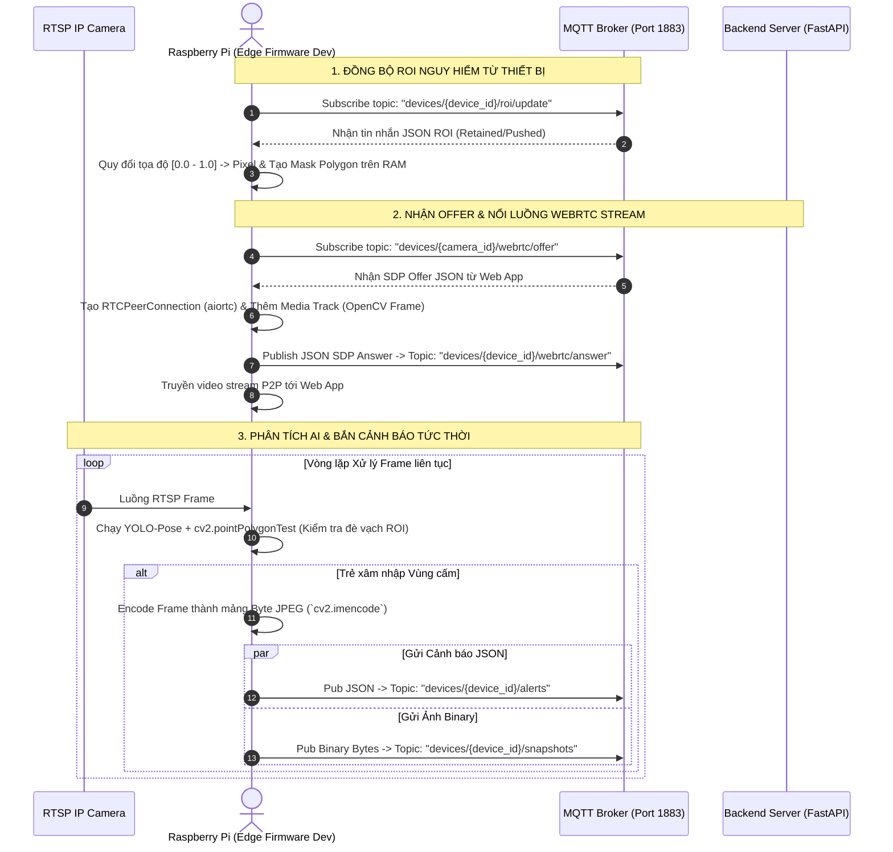

# 📋 Task Guide: Tích Hợp Edge Firmware (Raspberry Pi / AI Engine) với Backend Service

**Dự án:** AI Child Guardian (Children Observer)  
**Người thực hiện:** Edge AI & Firmware Developer (Dev 2)  
**Tài liệu liên quan:** `README.md` (Sequence Diagram), `module_backend_infra/api_and_mqtt_specification.md`  

---

## 🎯 Mục Tiêu Đồ Án
Kết nối ứng dụng phần mềm biên **Edge Firmware** (`module_edge_firmware/`) chạy trên thiết bị Raspberry Pi / Jetson với **MQTT Broker & Backend Server** (`module_backend_infra/`) để thực hiện:
1. Lắng nghe và đồng bộ Vùng cấm nguy hiểm (ROI) được phụ huynh cấu hình từ xa qua MQTT.
2. Thiết lập luồng Video Streaming thời gian thực bằng **WebRTC (`aiortc`)** khi nhận SDP Offer từ Web App.
3. Chạy pipeline AI (YOLO-Pose / Object Detection), kiểm tra xâm nhập Vùng cấm (ROI Violation).
4. Phát tin nhắn Cảnh báo (Alert JSON) và Ảnh chụp bằng chứng (Binary Snapshot JPEG) lên MQTT Broker khi phát hiện sự cố.

---

## 📌 Sơ Đồ Luồng Tương Tác Edge Firmware (Dựa trên Sequence Diagram)



---

## 🚀 Danh Sách Nhiệm Vụ Chi Tiết (Checklist)

### Task 1: Tích Hợp MQTT Client & Đồng Bộ Vùng Cấm (ROI)
- [ ] **1.1. Khởi Tạo MQTT Client (`aiomqtt` hoặc `paho-mqtt`)**:
  - Kết nối tới MQTT Broker tại Host/Port cấu hình trong `.env` (`MQTT_BROKER_HOST`, `MQTT_BROKER_PORT`).
- [ ] **1.2. Subscribe Topic Cấu Hình ROI**:
  - Đăng ký nhận tin nhắn từ Topic: `devices/{device_id}/roi/update` hoặc `camera/{camera_id}/roi`.
- [ ] **1.3. Xử Lý Tọa Độ & Cập Nhật Mask RAM (`module_edge_firmware/roi.py`)**:
  - Nhận mảng tọa độ điểm chuẩn hóa $[0.0 \rightarrow 1.0]$:
    ```json
    [
      {"name": "Lan can ban công", "points": [{"x": 0.1, "y": 0.1}, {"x": 0.6, "y": 0.1}, {"x": 0.6, "y": 0.8}, {"x": 0.1, "y": 0.8}]}
    ]
    ```
  - Quy đổi tọa độ tương đối sang Pixel thực tế của Frame OpenCV $(W_{\text{frame}}, H_{\text{frame}})$:
    $$X_{\text{pixel}} = \text{point.x} \times W_{\text{frame}}, \quad Y_{\text{pixel}} = \text{point.y} \times H_{\text{frame}}$$
  - Lưu mảng Polygon NumPy `np.array(pts, np.int32)` trên RAM để phục vụ việc so sánh đè vạch nhanh.

### Task 2: Triển Khai Server WebRTC Video Stream (`aiortc`)
- [ ] **2.1. Subscribe Topic WebRTC Offer**:
  - Đăng ký lắng nghe Topic: `devices/{camera_id}/webrtc/offer`.
- [ ] **2.2. Khởi Tạo WebRTC Peer Connection (`module_edge_firmware/webrtc/`)**:
  - Khi nhận gói tin SDP Offer từ Web Client:
    ```json
    { "sender": "web_parent_01", "target": "camera_01", "type": "offer", "sdp": "v=0..." }
    ```
  - Tạo `pc = RTCPeerConnection()`.
  - Thêm Custom Video Track (`VideoStreamTrack`) để lấy khung hình trực tiếp từ OpenCV Capture / AI Pipeline.
  - Gọi `await pc.setRemoteDescription(RTCSessionDescription(sdp=offer_sdp, type='offer'))`.
  - Tạo Answer: `answer = await pc.createAnswer()`, gọi `await pc.setLocalDescription(answer)`.
- [ ] **2.3. Trả Lời SDP Answer về MQTT**:
  - Publish gói tin SDP Answer về Topic `devices/{device_id}/webrtc/answer`:
    ```json
    {
      "target": "web_parent_01",
      "type": "answer",
      "sdp": pc.localDescription.sdp
    }
    ```

### Task 3: Pipeline AI Detection & Kiểm Tra Vi Phạm Vùng Cấm
- [ ] **3.1. Đọc Luồng RTSP Frame**:
  - Đọc luồng camera bằng OpenCV `cv2.VideoCapture(rtsp_url)`.
- [ ] **3.2. Chạy Mô Hình YOLO-Pose / Object Detection**:
  - Đưa Frame vào mô hình AI thu được bounding box hoặc các điểm keypoints của trẻ em (Bàn chân, Bàn tay, Đầu).
- [ ] **3.3. Kiểm Tra Xâm Nhập ROI (Overlap Test)**:
  - Sử dụng hàm `cv2.pointPolygonTest(roi_polygon, (keypoint_x, keypoint_y), False)`:
    - Nếu giá trị $\ge 0$: Điểm keypoint nằm **BÊN TRONG** hoặc **NẰM TRÊN BỜ RÀO** vùng cấm $\rightarrow$ **KÍCH HOẠT CẢNH BÁO**.

### Task 4: Bắn Cảnh Báo (Alert) & Ảnh Bằng Chứng (Snapshot Binary)
- [ ] **4.1. Mã Hóa Ảnh Frame Bằng Chứng**:
  - Khi phát hiện vi phạm, mã hóa frame hiện tại sang định dạng mảng byte JPEG:
    ```python
    _, buffer = cv2.imencode('.jpg', frame)
    image_bytes = buffer.tobytes()
    ```
- [ ] **4.2. Gửi Cảnh Báo JSON (Topic: `devices/{device_id}/alerts`)**:
  - Publish tin nhắn JSON:
    ```json
    {
      "camera_id": "cam_living_room_01",
      "title": "Phát hiện trẻ trèo lan can ban công",
      "severity": "danger",
      "snapshot_url": "cam_01_1786675200.jpg",
      "roi_name": "Lan can ban công"
    }
    ```
- [ ] **4.3. Gửi Ảnh Snapshot Binary (Topic: `devices/{device_id}/snapshots`)**:
  - Publish trực tiếp mảng byte `image_bytes` (Binary payload). Backend Server sẽ nhận và tự động lưu đĩa file JPEG.

---

## 🧪 Tiêu Chí Nghiệm Thu (Acceptance Criteria)

1. [ ] Firmware nhận được tin nhắn MQTT ROI update và chuyển đổi chính xác tọa độ sang NumPy Polygon mask.
2. [ ] Phản hồi gói tin SDP Answer qua MQTT ngay khi nhận được SDP Offer và phát luồng video WebRTC ổn định.
3. [ ] Phát hiện chính xác trường hợp đối tượng đi vào vùng cấm ROI.
4. [ ] Đẩy thành công cả 2 gói tin (JSON Alert & Binary Snapshot) lên MQTT Broker khi có vi phạm.
