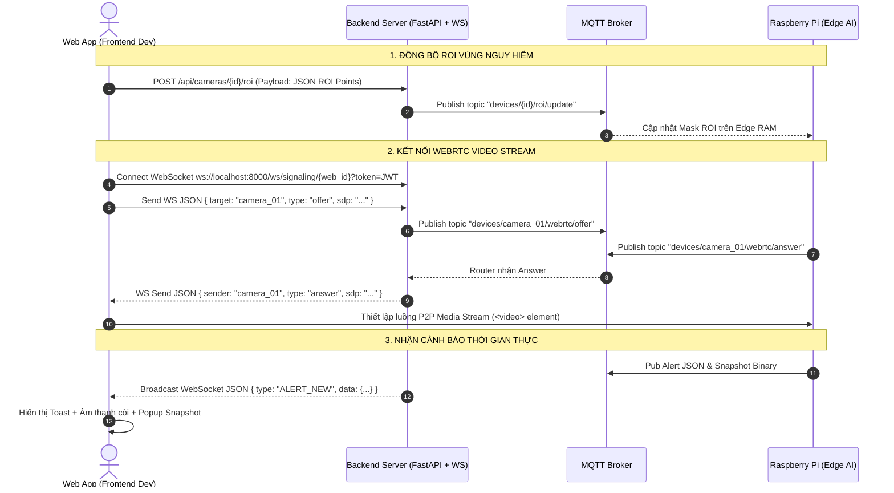

# 📋 Task Guide: Tích Hợp Frontend (React + TypeScript) với Backend Service

**Dự án:** AI Child Guardian (Children Observer)  
**Người thực hiện:** Frontend Developer (Dev 1)  
**Tài liệu liên quan:** `README.md` (Sequence Diagram), `module_backend_infra/api_and_mqtt_specification.md`  

---

## 🎯 Mục Tiêu Đồ Án
Kết nối ứng dụng Web React (`frontend/`) với máy chủ **FastAPI Backend** (`module_backend_infra/`) để thực hiện:
1. Xử lý Đăng ký / Đăng nhập / Xác thực JWT.
2. Quản lý Thiết bị & Camera, Vẽ vùng nguy hiểm (ROI) trên Canvas/SVG.
3. Khởi tạo luồng Video thời gian thực độ trễ thấp bằng **WebRTC P2P** (qua WebSocket Signaling).
4. Nhận thông báo Cảnh báo nguy hiểm thời gian thực (Real-time Alert Broadcast) và hiển thị hình ảnh snapshot bằng chứng.

---

## 📌 Sơ Đồ Luồng Tương Tác Frontend (Dựa trên Sequence Diagram)



---

## 🚀 Danh Sách Nhiệm Vụ Chi Tiết (Checklist)

### Task 1: Tích Hợp Authentication & Authorization
- [x] **1.1. Service Auth (`src/services/authApi.ts`)**:
  - Gọi `POST /api/auth/login` lấy `access_token`. Lưu token vào `localStorage` hoặc Cookie.
  - Cấu hình Axios / Fetch Interceptor tự động gắn Header `Authorization: Bearer <JWT_TOKEN>` cho mọi request HTTP.
- [x] **1.2. Profile & Telegram Linking (`src/components/Profile/`)**:
  - Lấy thông tin phụ huynh: `GET /api/auth/me`.
  - Cho phép người dùng nhập `telegram_chat_id` và gọi `PATCH /api/auth/me` để liên kết bot nhận cảnh báo qua Telegram.

### Task 2: Quản Lý Camera & Cấu Hình ROI (Region of Interest)
- [x] **2.1. Lấy danh sách Camera**:
  - Gọi `GET /api/cameras/` hiển thị danh sách Camera hiện có cùng danh sách vùng cấm `roi_zones`.
- [x] **2.2. Vẽ Vùng Nguy Hiểm Động (`src/components/ROI/ROISVGOverlay.tsx`)**:
  - Sử dụng thẻ `<svg>` hoặc `<canvas>` đè lên luồng `<video>`.
  - Cho phép phụ huynh click chuột chọn các điểm tọa độ chuẩn hóa $[0.0 \rightarrow 1.0]$ tương đối theo độ phân giải video:
    $$\text{point\_x} = \frac{X_{\text{click}}}{W_{\text{video}}}, \quad \text{point\_y} = \frac{Y_{\text{click}}}{H_{\text{video}}}$$
- [x] **2.3. Lưu ROI xuống Backend**:
  - Gửi request `POST /api/cameras/{camera_id_string}/roi` với cấu trúc payload:
    ```json
    [
      {
        "name": "Lan can ban công",
        "sensitivity": "high",
        "enabled": true,
        "points": [
          {"x": 0.1, "y": 0.1},
          {"x": 0.6, "y": 0.1},
          {"x": 0.6, "y": 0.8},
          {"x": 0.1, "y": 0.8}
        ]
      }
    ]
    ```

### Task 3: Kết Nối Video Stream WebRTC P2P (Độ trễ < 100ms)
- [x] **3.1. Khởi Tạo Kết Nối WebSocket Signaling (`src/services/webrtcService.ts`)**:
  - Kết nối tới `ws://localhost:8000/ws/signaling/web_parent_01?token=<JWT_TOKEN>`.
  - Lắng nghe sự kiện `onmessage` nhận SDP Answer & ICE Candidate từ server.
- [x] **3.2. Tạo WebRTC Peer Connection (`RTCPeerConnection`)**:
  - Khởi tạo `pc = new RTCPeerConnection({ iceServers: [{ urls: "stun:stun.l.google.com:19302" }] })`.
  - Lắng nghe `pc.ontrack = (event) => { videoRef.current.srcObject = event.streams[0]; }`.
- [x] **3.3. Quy Trình Bắt Tay (Handshake)**:
  1. Tạo Offer: `const offer = await pc.createOffer(); await pc.setLocalDescription(offer);`
  2. Gửi Offer qua WebSocket:
     ```json
     {
       "target": "camera_01",
       "type": "offer",
       "sdp": offer.sdp
     }
     ```
  3. Khi nhận tin nhắn `type === "answer"` từ WebSocket:
     ```javascript
     await pc.setRemoteDescription(new RTCSessionDescription({ type: "answer", sdp: data.sdp }));
     ```

### Task 4: Xử Lý Cảnh Báo Real-time & Snapshot Viewer
- [x] **4.1. Real-time Toast & Sound (`src/components/Alerts/`)**:
  - Lắng nghe sự kiện WebSocket khi có `message.type === "ALERT_NEW"`.
  - Kích hoạt âm thanh còi báo động (audio alert) và hiển thị thông báo popup Toast đỏ (`severity === "danger"`).
- [x] **4.2. Hiển thị Ảnh Chụp Bằng Chứng (Snapshot)**:
  - Render URL ảnh bằng chứng: `http://localhost:8000/snapshots/{data.snapshot_url}`.
- [x] **4.3. Tra Cứu Lịch Sử Cảnh Báo**:
  - Trích xuất dữ liệu lịch sử bằng `GET /api/alerts/?camera_id=cam_01&limit=20`.

---

## 🧪 Tiêu Chí Nghiệm Thu (Acceptance Criteria)

1. [x] Đăng nhập thành công và lưu JWT token chuẩn xác.
2. [x] Vẽ được polygon ROI trên màn hình Web và lưu thành công xuống API.
3. [x] Hiển thị video stream WebRTC trơn tru với độ trễ thấp (< 200ms).
4. [x] Khi Backend phát sự kiện `ALERT_NEW`, màn hình Frontend nổ thông báo tức thì và hiển thị được file ảnh snapshot.
