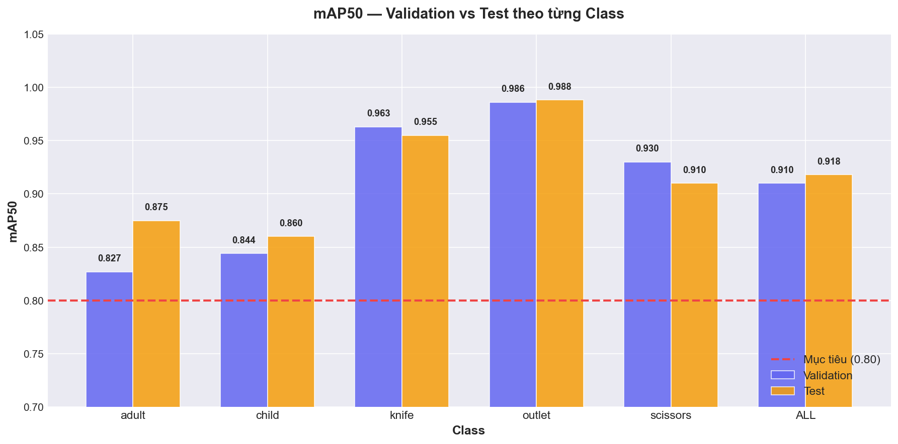
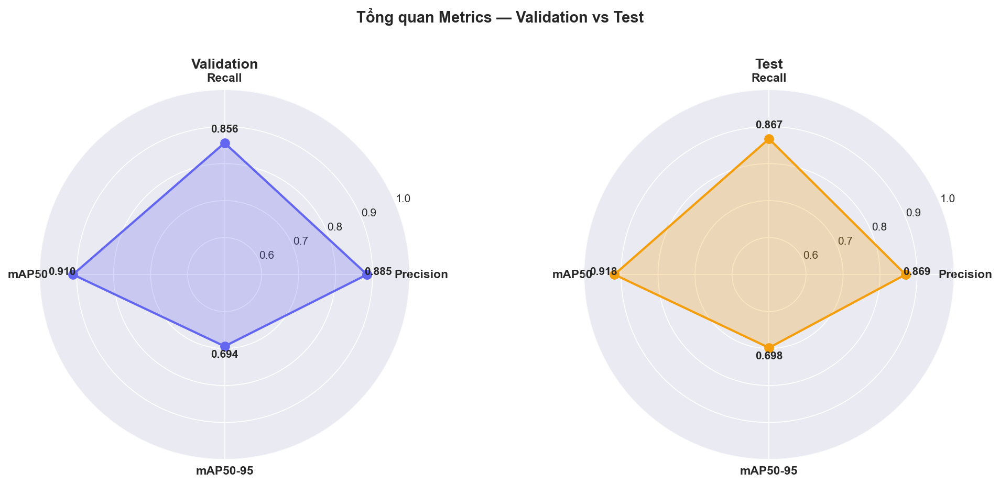
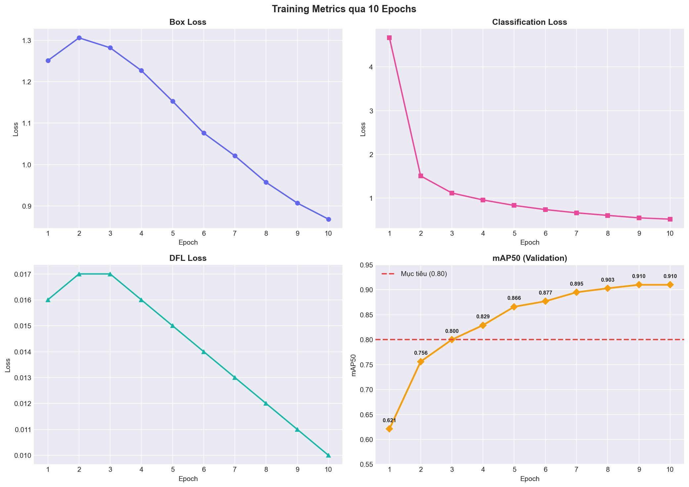
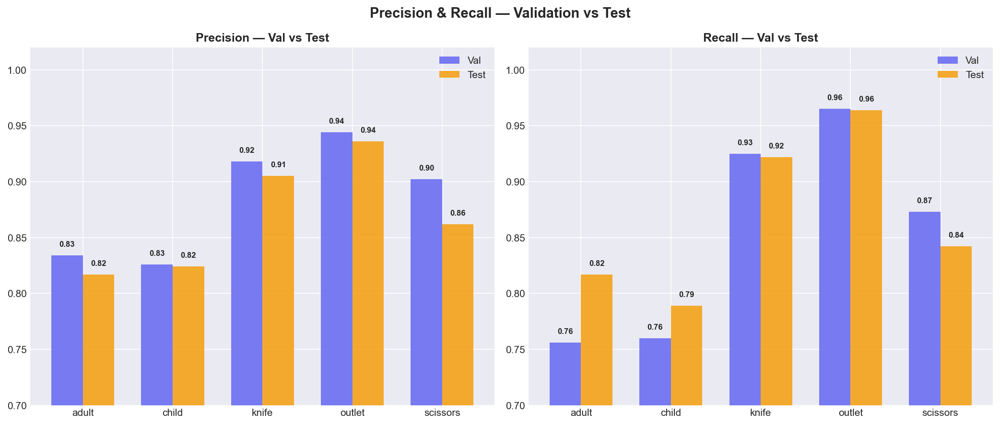
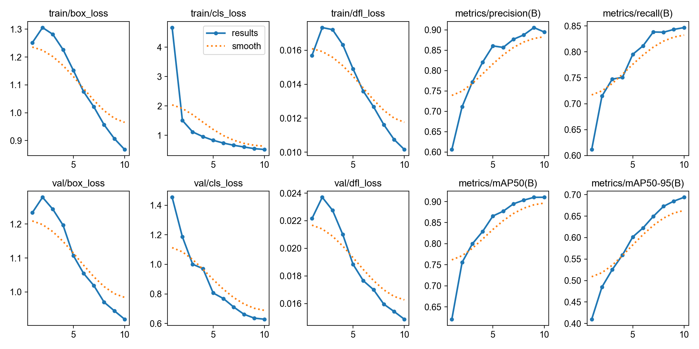
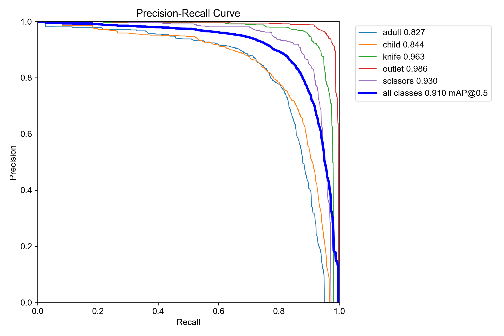
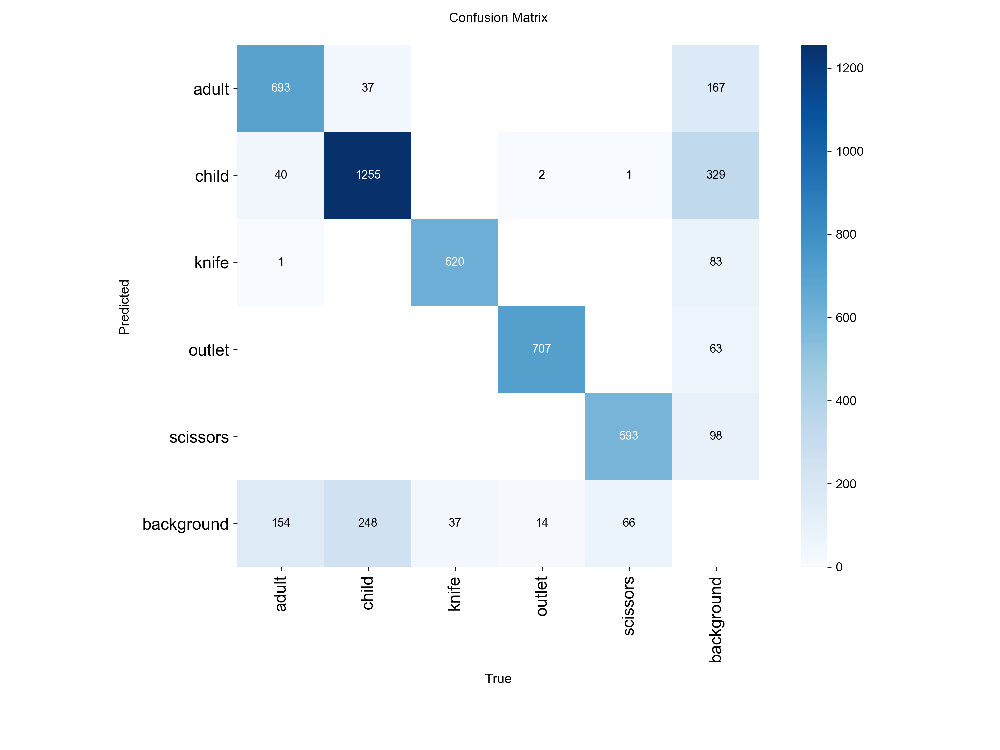
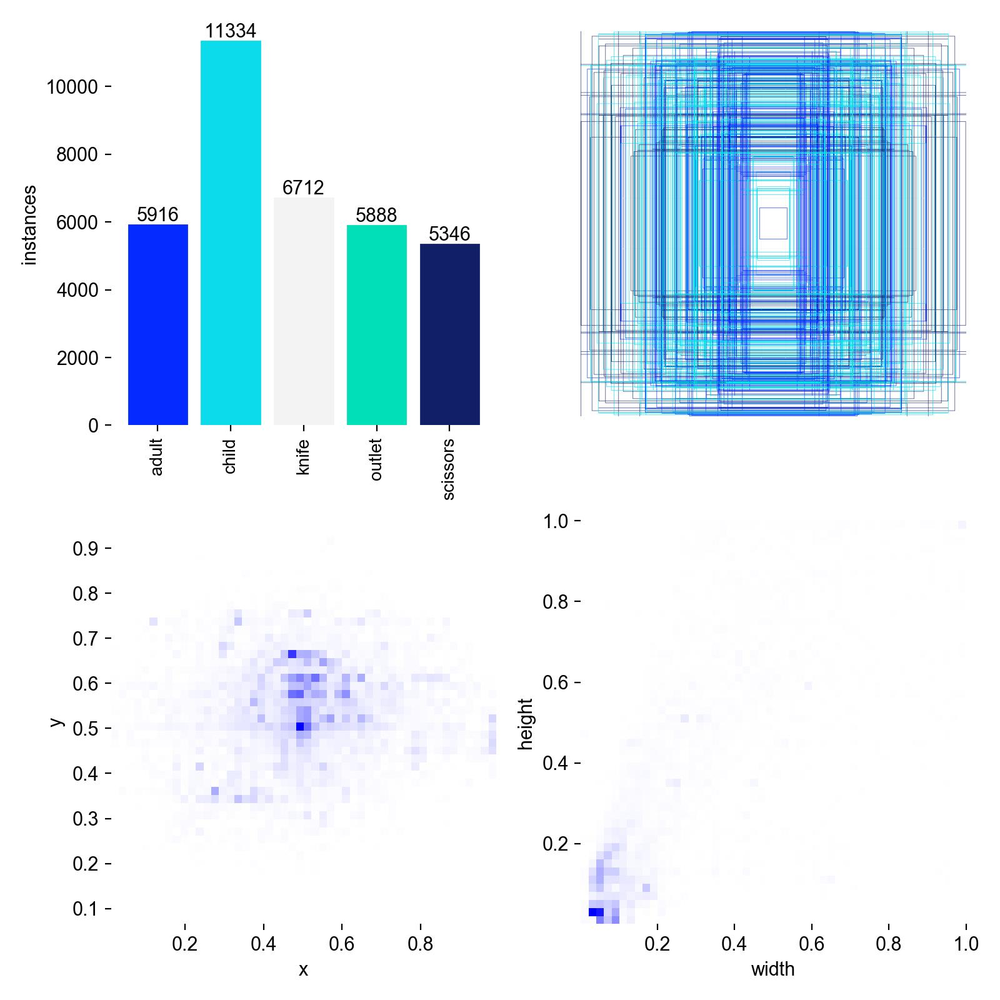

# 📊 Báo cáo Kết quả Training & Đánh giá — ROI Detection

## 1. Cấu hình Training

| Thông số | Giá trị |
|---|---|
| **Model** | YOLO26n (Nano) — 2.37M parameters, 5.2 GFLOPs |
| **Dataset** | KidSentry Master Dataset (Roboflow) |
| **Train / Val / Test** | 15,774 / 2,106 / 1,033 ảnh |
| **Classes** | 5 (adult, child, knife, outlet, scissors) |
| **Epochs** | 10 |
| **Batch size** | 16 |
| **Image size** | 640 × 640 |
| **Optimizer** | AdamW (lr=0.001111, momentum=0.9) |
| **GPU** | NVIDIA GeForce RTX 4050 Laptop (6140 MiB) |
| **Thời gian training** | 0.526 giờ (~32 phút) |

---

## 2. Kết quả trên tập Validation (2,106 ảnh)

| Class | Images | Instances | Precision | Recall | mAP50 | mAP50-95 |
|---|---|---|---|---|---|---|
| 🔌 **outlet** | 533 | 723 | 0.944 | 0.965 | **0.986** | 0.807 |
| 🔪 **knife** | 417 | 657 | 0.918 | 0.925 | **0.963** | 0.778 |
| ✂️ **scissors** | 519 | 660 | 0.902 | 0.873 | **0.930** | 0.733 |
| 👶 **child** | 733 | 1540 | 0.826 | 0.760 | **0.844** | 0.554 |
| 👨 **adult** | 607 | 888 | 0.834 | 0.756 | **0.827** | 0.598 |
| **Tổng (all)** | **2106** | **4468** | **0.885** | **0.856** | **0.910** | **0.694** |

---

## 3. Kết quả trên tập Test (1,033 ảnh)

> [!IMPORTANT]
> Tập test là dữ liệu mà model **chưa từng thấy** trong quá trình training lẫn validation. Đây là thước đo đáng tin cậy nhất.

| Class | Images | Instances | Precision | Recall | mAP50 | mAP50-95 |
|---|---|---|---|---|---|---|
| 🔌 **outlet** | 240 | 321 | 0.936 | 0.964 | **0.988** | 0.812 |
| 🔪 **knife** | 209 | 293 | 0.905 | 0.922 | **0.955** | 0.768 |
| ✂️ **scissors** | 225 | 298 | 0.862 | 0.842 | **0.910** | 0.706 |
| 👨 **adult** | 297 | 404 | 0.817 | 0.817 | **0.875** | 0.651 |
| 👶 **child** | 371 | 841 | 0.824 | 0.789 | **0.860** | 0.555 |
| **Tổng (all)** | **1033** | **2157** | **0.869** | **0.867** | **0.918** | **0.698** |

---

## 4. So sánh Validation vs Test

| Metric | Validation | Test | Chênh lệch |
|---|---|---|---|
| **Precision** | 0.885 | 0.869 | -0.016 |
| **Recall** | 0.856 | 0.867 | +0.011 |
| **mAP50** | 0.910 | **0.918** | +0.008 |
| **mAP50-95** | 0.694 | **0.698** | +0.004 |

> [!TIP]
> Kết quả trên test **cao hơn nhẹ** so với val → model **không bị overfitting**, tổng quát hóa tốt trên dữ liệu mới.

### So sánh theo từng class (mAP50)

| Class | Val | Test | Chênh lệch |
|---|---|---|---|
| 🔌 outlet | 0.986 | 0.988 | +0.002 |
| 🔪 knife | 0.963 | 0.955 | -0.008 |
| ✂️ scissors | 0.930 | 0.910 | -0.020 |
| 👨 adult | 0.827 | 0.875 | +0.048 |
| 👶 child | 0.844 | 0.860 | +0.016 |

---

## 5. Tiến trình Training qua 10 Epochs

| Epoch | Box Loss | Cls Loss | DFL Loss | Precision | Recall | mAP50 | mAP50-95 |
|---|---|---|---|---|---|---|---|
| 1 | 1.251 | 4.666 | 0.016 | 0.606 | 0.612 | 0.621 | 0.410 |
| 2 | 1.306 | 1.507 | 0.017 | 0.711 | 0.715 | 0.756 | 0.485 |
| 3 | 1.282 | 1.116 | 0.017 | 0.772 | 0.747 | 0.800 | 0.525 |
| 4 | 1.227 | 0.956 | 0.016 | 0.821 | 0.751 | 0.829 | 0.560 |
| 5 | 1.153 | 0.831 | 0.015 | 0.861 | 0.795 | 0.866 | 0.602 |
| 6 | 1.076 | 0.736 | 0.014 | 0.857 | 0.812 | 0.877 | 0.622 |
| 7 | 1.021 | 0.662 | 0.013 | 0.877 | 0.838 | 0.895 | 0.649 |
| 8 | 0.957 | 0.603 | 0.012 | 0.888 | 0.838 | 0.903 | 0.673 |
| 9 | 0.907 | 0.547 | 0.011 | 0.906 | 0.843 | **0.910** | 0.685 |
| 10 | 0.868 | 0.517 | 0.010 | 0.895 | 0.847 | **0.910** | 0.694 |

> [!NOTE]
> - **Loss giảm đều** qua mỗi epoch → model học tốt, không overfitting
> - **mAP50 đạt mục tiêu 0.80 từ epoch 3**, tiếp tục tăng lên 0.91 ở epoch 9-10
> - Model bắt đầu hội tụ ở epoch 9-10 (mAP50 không tăng thêm)

---

## 6. Biểu đồ

### 6.1 mAP50 — Validation vs Test theo từng Class

### 6.2 Tổng quan Metrics — Radar Chart

### 6.3 Training Progress — Loss & mAP qua 10 Epochs

### 6.4 Precision & Recall — Val vs Test

### 6.5 YOLO Training Curves (gốc)

### 6.6 Precision-Recall Curve

### 6.7 Confusion Matrix

### 6.8 Phân bố Dataset

### 6.9 Ví dụ Dự đoán trên Validation Set

---

## 7. Tốc độ Inference

| Giai đoạn | Thời gian |
|---|---|
| Preprocess | 0.2 ms |
| Inference | 2.1 ms |
| Postprocess | 0.2 ms |
| **Tổng** | **~2.5 ms/ảnh ≈ 400 FPS** |

> [!TIP]
> Tốc độ 400 FPS dư sức cho camera giám sát real-time (yêu cầu chỉ 25-30 FPS).

---

## 8. File đầu ra

| File | Đường dẫn | Kích thước |
|---|---|---|
| **Best weights** | `runs/detect/weights/roi_detection/childsun_yolo26-4/weights/best.pt` | 5.4 MB |
| **Last weights** | `runs/detect/weights/roi_detection/childsun_yolo26-4/weights/last.pt` | 5.4 MB |
| **Model Registry** | `weights/registry.json` | — |
| **Training plots** | `runs/detect/weights/roi_detection/childsun_yolo26-4/` | 19 files |

---

## 9. Đối chiếu Definition of Done (DoD)

| Tiêu chí | Yêu cầu | Kết quả (Test) | Trạng thái |
|---|---|---|---|
| mAP50 tổng | ≥ 0.80 | **0.918** | ✅ Đạt |
| Phát hiện trẻ em | mAP50 > 0.80 | **0.860** | ✅ Đạt |
| Phát hiện người lớn | mAP50 > 0.80 | **0.875** | ✅ Đạt |
| Phát hiện dao | mAP50 > 0.80 | **0.955** | ✅ Đạt |
| Phát hiện ổ điện | mAP50 > 0.80 | **0.988** | ✅ Đạt |
| Phát hiện kéo | mAP50 > 0.80 | **0.910** | ✅ Đạt |
| Không overfitting | Test ≈ Val | Test (0.918) ≥ Val (0.910) | ✅ Đạt |
| Real-time inference | < 50ms/frame | **2.5 ms** | ✅ Đạt |
| Model registry | Cập nhật | `weights/registry.json` | ✅ Đạt |

> [!IMPORTANT]
> **Tất cả tiêu chí DoD đều đạt.** Model YOLO26n đã sẵn sàng để tích hợp vào Edge Pipeline và export sang ONNX cho deployment.
